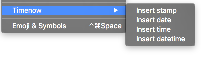

# `tn` - timenow 

Sublime Text plugin to insert **timestamp**, **date**, **time** and **datetime**.

### Install
1. Open [packagecontrol.io](packagecontro.io) - (<kbd>ctrl</kbd> or <kbd>⌘</kbd>) +  <kbd>⇧</kbd> + <kbd>p</kbd>
2. Type Timenow
3. :white_check_mark: Installed!

### Usage
`Edit` ⇢ `Timenow`



### Custom formats
`Preferences` ⇢ `Package Settings` ⇢ `Timenow` ⇢ `Settings User`

```python
{
  "date_format":     "%Y-%m-%d:%S",
  "time_format":     "%H:%M:%S",
  "datetime_format": "%Y-%m-%d %H:%M",
  "stamp_format":    "%y%m%d%H%M%S"
}
```

### License
● **filipe** - [WTFPL](LICENSE.md)
